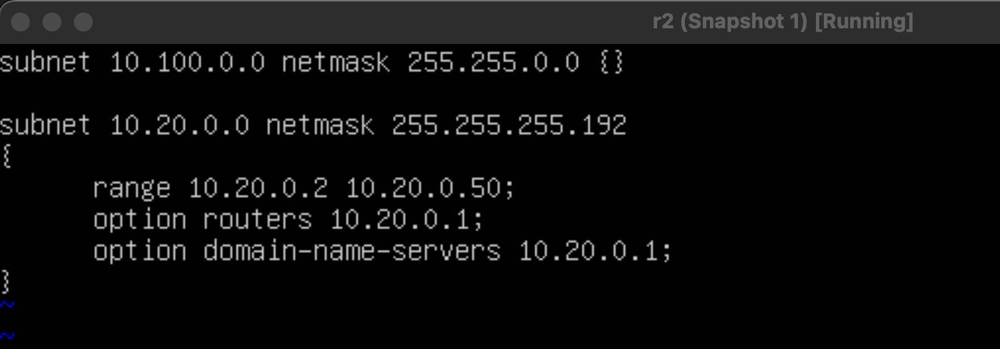
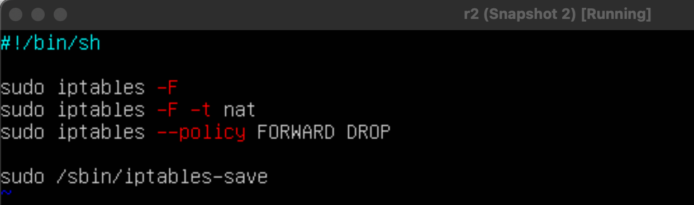

## Part 1. Инструмент **ipcalc**

* Адрес сети *192.167.38.54/13*

    

* Перевод маски *255.255.255.0* в префиксную и двоичную запись, */15* в обычную и двоичную, *11111111.11111111.11111111.11110000* в обычную и префиксную

    

    

        

* Минимальный и максимальный хост в сети *12.167.38.4* при масках: */8*, *11111111.11111111.00000000.00000000*, *255.255.254.0* и */4*

    

    

     

     

* Определи и запиши в отчёт, можно ли обратиться к приложению, работающему на localhost, со следующими IP: *194.34.23.100*, *127.0.0.2*, *127.1.0.1*, *128.0.0.1*

194.34.23.100 - нет
127.0.0.2 - да
127.1.0.1 - нет
128.0.0.1 - да

диапазон 127.0.0.1 — 127.255.255.254

* Какие из перечисленных IP можно использовать в качестве публичного, а какие только в качестве частных: 

частные:

10.0.0.45, 192.168.4.2, 172.20.250.4, 172.16.255.255, 10.10.10.10,

публичные:

134.43.0.2, 172.0.2.1, 192.172.0.1, 192.169.168.1, 172.68.0.2

диапазон частных:
10.0.0.0 – 10.255.255.255
172.16.0.0 – 172.31.255.255
192.168.0.0 – 192.168.255.255
100.64.0.0 – 100.127.255.255

* Какие из перечисленных IP адресов шлюза возможны у сети *10.10.0.0/18*: 

10.0.0.1 - нет
10.10.0.2 - да
10.10.10.10 - да
10.10.100.1 - нет
10.10.1.255 - да

 

## Part 2. Статическая маршрутизация между двумя машинами

 

* С помощью команды `ip a` посмотри существующие сетевые интерфейсы.

     

     

* Опиши сетевой интерфейс, соответствующий внутренней сети, на обеих машинах и задать следующие адреса и маски: ws1 - *192.168.100.10*, маска */16*, ws2 - *172.24.116.8*, маска */12*.

     

     

* Выполни команду `netplan apply` для перезапуска сервиса сети.

* Добавь статический маршрут от одной машины до другой и обратно при помощи команды вида `ip r add`.

     

     

* Пропингуй соединение между машинами.

     

     

* Перезапусти машины.
reboot

* Добавь статический маршрут от одной машины до другой с помощью файла */etc/netplan/00-installer-config.yaml*.

     

     

* Пропингуй соединение между машинами.

     

     

## Part 3. Утилита **iperf3**

* Переведи и запиши в отчёт: 8 Mbps в MB/s, 100 MB/s в Kbps, 1 Gbps в Mbps.

8 Mbps = 1 MB/s
100 MB/s =  100000 Kbps
1 Gbps = 1000 Mbps

* Измерь скорость соединения между ws1 и ws2.

ws2:
     

ws1:
     

## Part 4. Сетевой экран

* Создай файл */etc/firewall.sh*, имитирующий фаерволл, на ws1 и ws2:

sudo vim /etc/firewall.sh

ws2:
     

ws1:
     
 
* Запусти файлы на обеих машинах командами `chmod +x /etc/firewall.sh` и `/etc/firewall.sh`.

     

Разница в стратегиях: ws1 мы сначала разрешаем пинговать, а после запрещаем(блокируем вывод). В машине ws2 сначала запрещаем, потом разрешаем. 

* Командой **ping** найди машину, которая не «пингуется», после чего утилитой **nmap** покажи, что хост машины запущен.

     

## Part 5. Статическая маршрутизация сети

* Подними пять виртуальных машин (3 рабочие станции (ws11, ws21, ws22) и 2 роутера (r1, r2)).

     

    <b>r1</b>  
    - Оставляем первый адаптер под NAT
    - Подключаем второй адаптер -> Внутренняя сеть -> устанавливаем имя сети "intnet1"
    - Подключаем третий адаптер -> Внутренняя сеть -> устанавливаем имя сети "intnet2"

    <b>r2</b>  
    - Оставляем первый адаптер под NAT
    - Подключаем второй адаптер -> Внутренняя сеть -> устанавливаем имя сети "intnet2"
    - Подключаем третий адаптер -> Внутренняя сеть -> устанавливаем имя сети "intnet3"

    <b>ws11</b>  
    - Оставляем первый адаптер под NAT
    - Подключаем второй адаптер -> Внутренняя сеть -> устанавливаем имя сети "intnet1"

    <b>ws21</b>  
    - Оставляем первый адаптер под NAT
    - Подключаем второй адаптер -> Внутренняя сеть -> устанавливаем имя сети "intnet3"

    <b>ws22</b>  
    - Оставляем первый адаптер под NAT
    - Подключаем второй адаптер -> Внутренняя сеть -> устанавливаем имя сети "intnet3"

* Настрой конфигурации машин в *etc/netplan/00-installer-config.yaml* согласно сети на рисунке.

<b>r1</b>  

     

 <b>r2</b>  

     

 <b>w11</b>  

    

  <b>w21</b>  

    

  <b>w22</b>  

    

* Перезапусти сервис сети - reboot на всех машинах. Если ошибок нет, то командой `ip -4 a` проверь, что адрес машины задан верно. 

<b>r1</b>  

     

 <b>r2</b>  

     

 <b>w11</b>  

    

  <b>w21</b>  

    

  <b>w22</b>  

   

* Также пропингуй ws22 с ws21. Аналогично пропингуй r1 с ws11.

  <b>w22 c w21</b>  

   

   <b>w21 c w22</b>  

   

   <b>r1 c w11</b>  

   

    <b>w11 c r1</b>  

   

* Для включения переадресации IP, выполни команду на роутерах:
`sysctl -w net.ipv4.ip_forward=1`

<b>r1</b>  

     

 <b>r2</b>  

   

* Открой файл */etc/sysctl.conf* и добавь в него следующую строку:
`net.ipv4.ip_forward = 1`

<b>r1</b>  

     

 <b>r2</b>  

   

* Настрой маршрут по-умолчанию (шлюз) для рабочих станций. Для этого добавь `default` перед IP роутера в файле конфигураций.

 <b>w11</b>  

   

 <b>w21</b>  

   

  <b>w22</b>  

   

* Вызови `ip r` и покажи, что добавился маршрут в таблицу маршрутизации.

 <b>w11</b>  

   

 <b>w21</b>  

   

  <b>w22</b>  

   

* Пропингуй с ws11 роутер r2 и покажи на r2, что пинг доходит. Для этого используй команду:
`tcpdump -tn -i eth0`

В w11 не пингуется, но через r2 мы видим пакеты, которые показывают, что пинг доходит

 <b>w11</b>  

   

 <b>r2</b>  

   

* Добавь в роутеры r1 и r2 статические маршруты в файле конфигураций. 

 <b>r1</b>  

   

 <b>r2</b>  

  

* Вызови `ip r` и покажи таблицы с маршрутами на обоих роутерах. 

 <b>r1</b>  

   

 <b>r2</b>  

  

* Запусти команды на ws11:
`ip r list 10.10.0.0/[маска сети]` и `ip r list 0.0.0.0/0`

  

Если не указать конкретный адрес перехода на пути пакета, то в качестве статического адреса указывается 0.0.0.0 по умолчанию

* Запусти на r1 команду дампа:
`tcpdump -tnv -i eth0`

  

  

Принцип работы построения пути при помощи traceroute
Каждый пакет проходит на своем пути определенное количество узлов, пока достигнет своей цели. Причем, каждый пакет имеет свое время жизни. Это количество узлов, которые может пройти пакет перед тем, как он будет уничтожен. Этот параметр записывается в заголовке TTL, каждый маршрутизатор, через который будет проходить пакет уменьшает его на единицу. При TTL=0 пакет уничтожается, а отправителю отсылается сообщение Time Exceeded.

Команда traceroute linux использует UDP пакеты. Она отправляет пакет с TTL=1 и смотрит адрес ответившего узла, дальше TTL=2, TTL=3 и так пока не достигнет цели. Каждый раз отправляется по три пакета и для каждого из них измеряется время прохождения. Пакет отправляется на случайный порт, который, скорее всего, не занят. Когда утилита traceroute получает сообщение от целевого узла о том, что порт недоступен трассировка считается завершенной.

* Запусти на r1 перехват сетевого трафика, проходящего через eth0 с помощью команды:
`tcpdump -n -i eth0 icmp`

* Пропингуй с ws11 несуществующий IP (например, *10.30.0.111*) с помощью команды:
`ping -c 1 10.30.0.111`

  

## Part 6. Динамическая настройка IP с помощью **DHCP**

* Для r2 настрой в файле */etc/dhcp/dhcpd.conf* конфигурацию службы **DHCP**:

  

* В файле *resolv.conf* пропиши `nameserver 8.8.8.8`.

  

* Перезагрузи службу **DHCP** командой `systemctl restart isc-dhcp-server`. Машину ws21 перезагрузи при помощи `reboot` и через `ip a` покажи, что она получила адрес. 

 <b>r2</b>  

sudo apt install isc-dhcp-server

  

 <b>w21</b>  

reboot

  

sudo netplan apply

  

 <b>w22</b>  

  

sudo netplan apply

* Также пропингуй ws22 с ws21.

  

   

* Укажи MAC адрес у ws11

   

sudo netplan apply

* Для r1 настрой аналогично r2, но сделай выдачу адресов с жесткой привязкой к MAC-адресу (ws11). 

netstat -r -n
ip a

etc/dhcp/dhcpd.conf. Добавляем в нем для сети 10.10.0.0/18 диапазон выдаваемых адресов (range), шлюз по умолчанию (option routers) и DNS-сервер (option domain-name-servers). Отдельно прописываем правило для хоста с MAC-адресом 10:10:10:10:10:BA - ему будет выдан IP-адрес 10.10.0.8

   

/etc/resolv.conf на 8.8.8.8

   

Перезапускаем службу DHCP командой systemctl restart isc-dhcp-server. После этого смотрим, работат ли наш DHCP сервер командой sudo systemctl status isc-dhcp-server

   

 <b>w11</b>  

    

 <b>пингуем ws11 c ws21</b>  

* Запроси с ws21 обновление ip адреса.

    

до обновления

    

после обновления (sudo dhclient -r - освобождает все сетевые адреса)

    

## Part 7. **NAT**

* В файле */etc/apache2/ports.conf* на ws22 и r1 измени строку `Listen 80` на `Listen 0.0.0.0:80`, то есть сделай сервер Apache2 общедоступным.

 <b>r1</b>  

   

 <b>w22</b>  

   

* Запусти веб-сервер Apache командой `service apache2 start` на ws22 и r1.

 <b>r1</b>  

   

 <b>w22</b>  

   

* Добавь в фаервол, созданный по аналогии с фаерволом из Части 4, на r2 следующие правила:
##### 1) Удаление правил в таблице filter - `iptables -F`;
##### 2) Удаление правил в таблице "NAT" - `iptables -F -t nat`;
##### 3) Отбрасывать все маршрутизируемые пакеты - `iptables --policy FORWARD DROP`.

   

   

##### Проверь соединение между ws22 и r1 командой `ping`.
*При запуске файла с этими правилами, ws22 не должна «пинговаться» с r1.*

   

##### 4) Разрешить маршрутизацию всех пакетов протокола **ICMP**.

   

   

##### Проверь соединение между ws22 и r1 командой `ping`.
*При запуске файла с этими правилами, ws22 должна «пинговаться» с r1.*

   

   

##### 5) Включи **SNAT**, а именно маскирование всех локальных ip из локальной сети, находящейся за r2 (по обозначениям из Части 5 - сеть 10.20.0.0).

##### 6) Включи **DNAT** на 8080 порт машины r2 и добавить к веб-серверу Apache, запущенному на ws22, доступ извне сети.

SNAT:
sudo iptables -t nat -A POSTROUTING -o enp0s8 -j SNAT --to-sorce 10.100.0.12

 - `-t nat` - добавляем правило в таблицу nat  
 - `-A POSTROUTING` - добавляем правило в цепочку POSTROUTING  
 - `-o enp0s8` - указываем исхяодящий интерфейс  
 - `-j SNAT` - указываем для правила действие SNAT  
 - `--to-source` - указываем адрес на интерфейсе, с которого планируется выпускать во внешнюю сеть IP пакеты, то есть тот адрес на который будем подменять все адреса из сети 10.20.0.0/26  
разрешаем передавать между интерфесами пакеты, относящиеся к уже установленным соединениям (sudo iptables -A -m state --state ESTABLISHED -j ACCEPT). Без этого просто не сможем передать никакой трафик из-за запрещающих правил выше в скрипте.

DNAT:
sudo iptables -t nat -A PREROUTING -i enp0s8 -p tcp --dport 8080 -j DNAT --to-destination 10.20.0.20:80

 - `-A PREROUTING` - добавляем правило в цепочку  PREROUTING  
 - `-i enp0s8` - указываем входящий интерфейс  
 - `-p tcp` - указываем протокол, по которому проходит трафик  
 - `--dport 8080` - указываем порт  
 - `-j DNAT` - действием для правила булет DNAT  
 - `--to-destination 10.20.0.20:80` - IP адрес, на который нужно заменить IP адрес назначения. На этот адрес будут перенаправляться все пакеты, приходящие на порт 8080 роутера r2
для доступа к Apache на ws22 разрешаем трафик по протоколу tcp, порт 80:
sudo iptables -A FORWARD -p tcp --dport 80 -j ACCEPT

   

##### Запусти файл также, как в Части 4.
*Перед тестированием рекомендуется отключить сетевой интерфейс **NAT** (его наличие можно проверить командой `ip a`) в VirtualBox, если он включен.*

до:
   

после:

   

##### Проверь соединение по TCP для **SNAT**: для этого с ws22 подключиться к серверу Apache на r1 командой:
`telnet [адрес] [порт]`

   

##### Проверь соединение по TCP для **DNAT**: для этого с r1 подключиться к серверу Apache на ws22 командой `telnet`

   

## Part 8. Дополнительно. Знакомство с **SSH Tunnels**

##### Запусти на r2 фаервол с правилами из Части 7.

   

##### Запусти веб-сервер **Apache** на ws22 только на localhost (то есть в файле */etc/apache2/ports.conf* измени строку `Listen 80` на `Listen localhost:80`).

   

   

##### Воспользуйся *Local TCP forwarding* с ws21 до ws22, чтобы получить доступ к веб-серверу на ws22 с ws21.

   

##### Воспользуйся *Remote TCP forwarding* c ws11 до ws22, чтобы получить доступ к веб-серверу на ws22 с ws11.

   

##### Для проверки, сработало ли подключение в обоих предыдущих пунктах, перейди во второй терминал (например, клавишами Alt + F2) и выполни команду:
`telnet 127.0.0.1 [локальный порт]`

   

   
