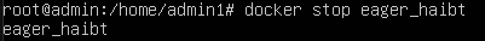
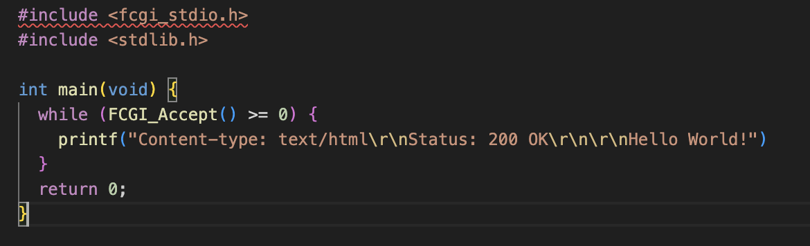
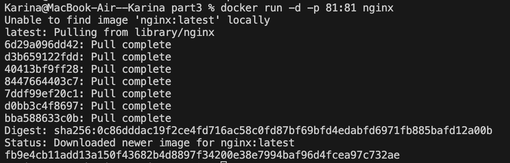

## Part 1. Готовый докер

##### Возьми официальный докер-образ с **nginx** и выкачай его при помощи `docker pull`.

##### Проверь наличие докер-образа через `docker images`.
##### Запусти докер-образ через `docker run -d [image_id|repository]`.

-d: это флаг, который указывает Docker на запуск контейнера в фоновом режиме (detached mode). Это означает, что контейнер будет работать в фоновом режиме, и командная строка будет освобождена для дальнейшего использования.

##### Проверь, что образ запустился через `docker ps`.

##### Посмотри информацию о контейнере через `docker inspect [container_id|container_name]`.

##### По выводу команды определи и помести в отчёт размер контейнера, список замапленных портов и ip контейнера.

##### Останови докер контейнер через `docker stop [container_id|container_name]`.
##### Проверь, что контейнер остановился через `docker ps`.

##### Запусти докер с портами 80 и 443 в контейнере, замапленными на такие же порты на локальной машине, через команду *run*.

##### Проверь, что в браузере по адресу *localhost:80* доступна стартовая страница **nginx**.

##### Перезапусти докер контейнер через `docker restart [container_id|container_name]`.

## Part 2. Операции с контейнером

##### Прочитай конфигурационный файл *nginx.conf* внутри докер контейнера через команду *exec*.

##### Создай на локальной машине файл *nginx.conf*.
Создала через команду touch

##### Настрой в нем по пути */status* отдачу страницы статуса сервера **nginx**.

##### Скопируй созданный файл *nginx.conf* внутрь докер-образа через команду `docker cp`.

##### Перезапусти **nginx** внутри докер-образа через команду *exec*.

##### Проверь, что по адресу *localhost:80/status* отдается страничка со статусом сервера **nginx**.

##### Экспортируй контейнер в файл *container.tar* через команду *export*.

##### Останови контейнер.

##### Удали образ через `docker rmi [image_id|repository]`, не удаляя перед этим контейнеры.

##### Удали остановленный контейнер.

##### Импортируй контейнер обратно через команду *import*.

##### Запусти импортированный контейнер.

##### Проверь, что по адресу *localhost:80/status* отдается страничка со статусом сервера **nginx**.

## Part 3. Мини веб-сервер

##### Напиши мини-сервер на **C** и **FastCgi**, который будет возвращать простейшую страничку с надписью `Hello World!`.

##### Запусти написанный мини-сервер через *spawn-fcgi* на порту 8080.

##### Напиши свой *nginx.conf*, который будет проксировать все запросы с 81 порта на *127.0.0.1:8080*.
##### Проверь, что в браузере по *localhost:81* отдается написанная тобой страничка.
##### Положи файл *nginx.conf* по пути *./nginx/nginx.conf* (это понадобится позже).

## Part 4. Свой докер

#### Напиши свой докер-образ, который:
##### 1) собирает исходники мини сервера на FastCgi из [Части 3](#part-3-мини-веб-сервер);
##### 2) запускает его на 8080 порту;
##### 3) копирует внутрь образа написанный *./nginx/nginx.conf*;
##### 4) запускает **nginx**.

##### Собери написанный докер-образ через `docker build` при этом указав имя и тег.

##### Проверь через `docker images`, что все собралось корректно.

##### Запусти собранный докер-образ с маппингом 81 порта на 80 на локальной машине и маппингом папки *./nginx* внутрь контейнера по адресу, где лежат конфигурационные файлы **nginx**'а (см. [Часть 2](#part-2-операции-с-контейнером)).

##### Допиши в *./nginx/nginx.conf* проксирование странички */status*, по которой надо отдавать статус сервера **nginx**.

## Part 5. **Dockle**

##### Просканируй образ из предыдущего задания через `dockle [image_id|repository]`.
##### Исправь образ так, чтобы при проверке через **dockle** не было ошибок и предупреждений.

## Part 6. Базовый **Docker Compose**

##### 1) Подними докер-контейнер из [Части 5](#part-5-инструмент-dockle) _(он должен работать в локальной сети, т. е. не нужно использовать инструкцию **EXPOSE** и мапить порты на локальную машину)_.
##### 2) Подними докер-контейнер с **nginx**, который будет проксировать все запросы с 8080 порта на 81 порт первого контейнера.
##### Замапь 8080 порт второго контейнера на 80 порт локальной машины.

##### Останови все запущенные контейнеры.

##### Собери и запусти проект с помощью команд `docker-compose build` и `docker-compose up`.

##### Проверь, что в браузере по *localhost:80* отдается написанная тобой страничка, как и ранее.
